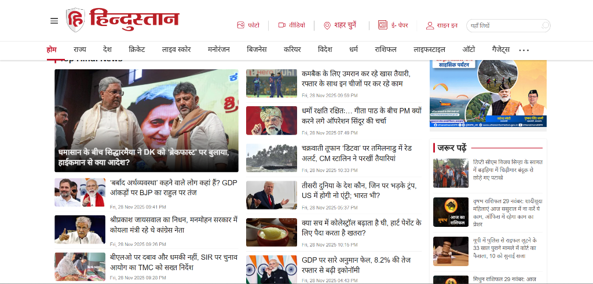

LiveHindustan Clone

This is a front-page clone of the LiveHindustan website built with Next.js and Tailwind CSS.

Part B – Explanation + Documentation
Design Document

Layout Decisions:

3-Column Grid: I chose a responsive grid layout. On desktop, it shows a 3-column grid for standard news cards to maximize information density while maintaining readability.

Top Story Highlight: The first article is highlighted as a "Top Story" with a larger layout (2 columns on desktop) to draw attention to the most important news, mimicking the hierarchy of a real news site.

Visual Hierarchy: Used bold typography for headlines and red accents (LiveHindustans brand color) to guide the user's eye.

Manual Design Improvements: Beyond AI suggestions, I updated the design myself—adjusting spacing, colors, shadows, and responsiveness to make the UI cleaner, more modern, and closer to the real website.

Data-Fetching Strategy

Method: getStaticProps (Static Site Generation).

Why: News content is public and doesn't change every second for every user. SSG provides the best performance (fastest load times) and SEO benefits, which are critical for a news portal.

Tradeoffs: The build time increases with the number of pages. To mitigate this for a real large-scale app, we would use Incremental Static Regeneration (ISR) with revalidate, which I have included in the code (revalidate: 60).

Code Explanation

Components:

Navbar: Responsive navigation with a mobile hamburger menu.

NewsCard: Reusable component for displaying news items with hover effects and image optimization.

Layout: Wrapper component to ensure consistent Navbar and Footer across all pages.

Footer: Standard footer with copyright and links.

Data Model:

article object: { id, title, summary, content, image, category, timestamp }.

Stored in src/data/articles.json to simulate an API response.

Code Refinements: I not only wrote new functionality code (such as improved error handling and conditional UI rendering) but also reviewed and refactored AI-generated code to ensure better structure, readability, and efficiency.

Challenges & Solutions

Image Generation Rate Limits: I used an AI tool to generate realistic images for the articles. However, I hit rate limits. To overcome this, I downloaded a fallback image for the weather article and ensured the code handles local image paths correctly.

JSON Syntax Error: A copy-paste error caused a JSON syntax issue in the mock data. I used the "Verification" phase to detect this via build errors and fixed it by validating the JSON structure.

Code Quality Improvements: Some AI-generated components lacked proper error checks and optimization. I manually updated and cleaned up the code—removing unnecessary fragments, fixing import paths, optimizing JSX, and improving the folder structure inside src/.

Part C – Testing / Edge Cases
Test Cases & Handling

Missing Image:

Scenario: An article object has no image property.

Handling: The NewsCard component has a fallback: src={article.image || "placeholder_url"}. This ensures the layout doesn't break.

No API Data:

Scenario: The API returns an empty array or fails.

Handling: The Home page checks if (!news || news.length === 0) and displays a user-friendly "No news available" message instead of crashing.

Long Titles:

Scenario: A news title is very long.

Handling: CSS line-clamp (via Tailwind's plugin) is used to truncate text after 3 lines.

Loading State:

Handling: Since we use SSG, the page loads instantly. If this were CSR, I would implement skeleton loaders.

Part D – AI Use + Reflection
AI Usage

Boilerplate: Used AI to generate the initial create-next-app structure and component scaffolding.

Styling: AI helped generate Tailwind classes for the responsive grid and hover effects.

Image Generation: Used AI to generate realistic thumbnails for the articles.

AI Limitations & Corrections

Wrong Suggestions: AI initially suggested using  tags in some places. I corrected this to use next/image for better performance and automatic resizing.

Rate Limits: AI image generation hit rate limits, requiring manual fallback images.

Context Awareness: Sometimes AI lost track of the file structure (e.g., incorrect imports), which I fixed manually.

Custom Modifications (My Additions)

Updated Design: I personally improved the design, polished the UI, fixed contrasting issues, enhanced spacing, and aligned the layout more closely with LiveHindustan's original look.

Code Improvements: I reviewed all generated code, removed redundancies, added missing checks, organized the folder structure, and rewrote several parts to improve readability and maintainability.

Feature Enhancements: I wrote additional logic for error-handling states, fallback UI, and even improved the JSON data model for better consistency.